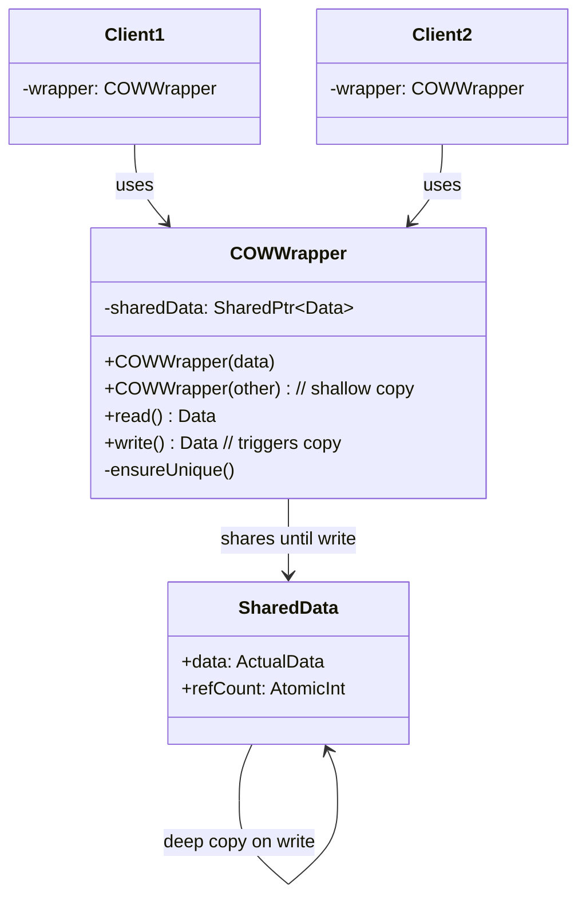
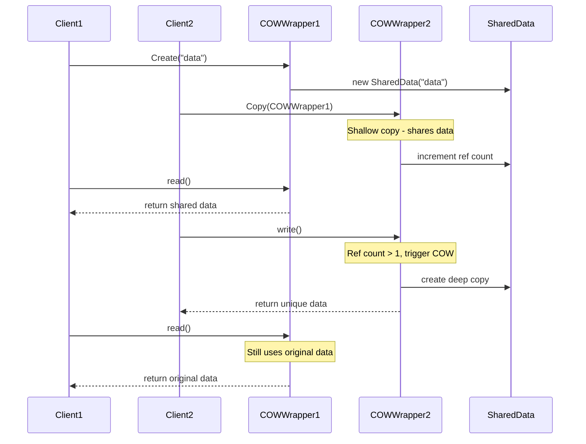
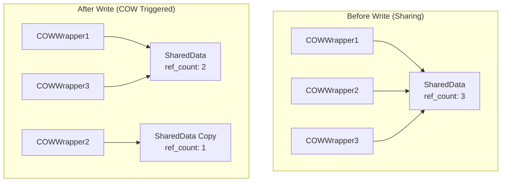
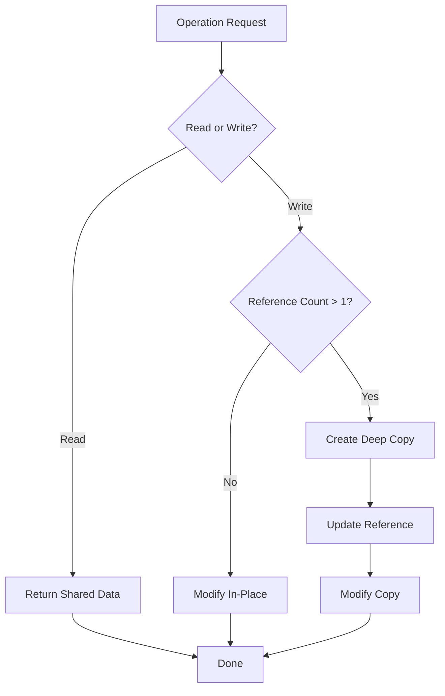

# Copy-on-Write Pattern

## Intent
Defer the expensive copy operation of shared data until one of the copies is actually modified, allowing multiple copies to share the same underlying data for efficiency.

## When to Use
- Expensive copy operations
- Frequent copying with rare modifications
- Memory optimization needed
- String implementations
- Container implementations

## Structure



### Copy-on-Write Lifecycle



### Memory Layout Before and After COW



### COW Decision Tree



## Implementation Details

### Key Components
1. **Shared Data**: Contains actual data and reference count
2. **COW Wrapper**: Manages sharing and copying
3. **Reference Counting**: Tracks number of owners
4. **Copy Trigger**: Detects when copy is needed
5. **Deep Copy**: Creates independent copy

### Algorithm
```
Copy-on-Write Process:
1. Initial Creation:
   - Allocate shared data
   - Set reference count to 1
   
2. Copy Operation:
   - Share pointer to same data
   - Increment reference count
   
3. Read Operation:
   - Return reference to shared data
   - No copying needed
   
4. Write Operation:
   - Check reference count
   - If count > 1:
     a. Create deep copy of data
     b. Update pointer to new copy
     c. Decrement old reference count
   - Perform modification
   
5. Destruction:
   - Decrement reference count
   - If count reaches 0, delete data
```

## Advantages
- Memory efficiency
- Fast copy operations
- Automatic optimization
- Transparent to users
- Lazy evaluation

## Disadvantages
- Reference counting overhead
- Thread safety complexity
- Unpredictable copy timing
- Memory fragmentation
- Implementation complexity

## Example Output
```
=== Copy-on-Write Pattern Demo ===

=== Basic Copy-on-Write String ===

Creating original string:
COW: Creating string: "Hello World"
String: "Hello World" (refs: 1, ptr: 0x1a2b3c4d)

Creating copy (shallow copy):
COW: Shallow copy (ref count: 2)
Original: String: "Hello World" (refs: 2, ptr: 0x1a2b3c4d)
Copy: String: "Hello World" (refs: 2, ptr: 0x1a2b3c4d)

Reading from both strings (no copy triggered):
str1 length: 11
str2[0]: H

Modifying copy (triggers COW):
COW: Creating copy for modification
COW: Appended " - Modified"
Original: String: "Hello World" (refs: 1, ptr: 0x1a2b3c4d)
Modified: String: "Hello World - Modified" (refs: 1, ptr: 0x5e6f7a8b)

Further modifications (no more copying):
COW: Inserted " Beautiful" at position 5
String: "Hello Beautiful World - Modified" (refs: 1, ptr: 0x5e6f7a8b)

=== Copy-on-Write Vector ===

Creating original vector:
COWVector: Creating vector with 5 elements
Vector[5] (refs: 1, ptr: 0x9c8d7e6f): 1 2 3 4 5 

Creating copies (shallow copies):
COWVector: Shallow copy (ref count: 2)
COWVector: Shallow copy (ref count: 3)
All vectors:
vec1: Vector[5] (refs: 3, ptr: 0x9c8d7e6f): 1 2 3 4 5 
vec2: Vector[5] (refs: 3, ptr: 0x9c8d7e6f): 1 2 3 4 5 
vec3: Vector[5] (refs: 3, ptr: 0x9c8d7e6f): 1 2 3 4 5 

Reading from vectors (no copy):
vec1.size(): 5
vec2[2]: 3
vec3.back(): 5

Modifying vec2 (triggers COW):
COWVector: Creating copy for modification
COWVector: Pushed back element
COWVector: Creating copy for modification
COWVector: Pushed back element

After modification:
vec1: Vector[5] (refs: 2, ptr: 0x9c8d7e6f): 1 2 3 4 5 
vec2: Vector[7] (refs: 1, ptr: 0x2f3e4d5c): 1 2 3 4 5 6 7 
vec3: Vector[5] (refs: 2, ptr: 0x9c8d7e6f): 1 2 3 4 5 

Modifying vec3 (triggers COW):
COWVector: Creating copy for modification
COWVector: Creating copy for modification
COWVector: Erased element at position 1

Final state:
vec1: Vector[5] (refs: 1, ptr: 0x9c8d7e6f): 1 2 3 4 5 
vec2: Vector[7] (refs: 1, ptr: 0x2f3e4d5c): 1 2 3 4 5 6 7 
vec3: Vector[4] (refs: 1, ptr: 0x6b7a8c9d): 99 3 4 5 

=== Copy-on-Write Document ===

Creating original document:
Document: Created with content: "Initial content"
Document (refs: 1):
  Content: "Initial content"
  History size: 1

Creating document snapshots:
Document: Shallow copy (ref count: 2)
Document: Shallow copy (ref count: 3)
All documents share same data:
doc1: Document (refs: 3):
  Content: "Initial content"
  History size: 1
snapshot1: Document (refs: 3):
  Content: "Initial content"
  History size: 1
snapshot2: Document (refs: 3):
  Content: "Initial content"
  History size: 1

Modifying original document:
Document: Creating copy for modification
Document: Appended: " - First edit"
Document: Appended: " - Second edit"
Document (refs: 1):
  Content: "Initial content - First edit - Second edit"
  History size: 3

Snapshots remain unchanged:
snapshot1: Document (refs: 2):
  Content: "Initial content"
  History size: 1
snapshot2: Document (refs: 2):
  Content: "Initial content"
  History size: 1

=== Copy-on-Write Benefits ===
1. Memory efficiency through sharing
2. Fast copy operations
3. Deferred expensive operations
4. Transparent to users
5. Thread-safe when implemented correctly
```

## Common Variations
1. **Basic COW**: Simple reference counting
2. **Thread-Safe COW**: With atomic operations
3. **Smart Pointer COW**: Using shared_ptr
4. **COW Containers**: Vectors, strings, etc.
5. **COW with Versioning**: Track modification history

## Related Patterns
- **Flyweight**: Share immutable data
- **Proxy**: Lazy initialization
- **Prototype**: Object cloning
- **Shared Pointer**: Reference counting
- **Lazy Loading**: Defer operations

## Best Practices
1. Use atomic operations for thread safety
2. Implement strong exception safety
3. Consider const-correctness carefully
4. Profile memory usage patterns
5. Document COW behavior clearly