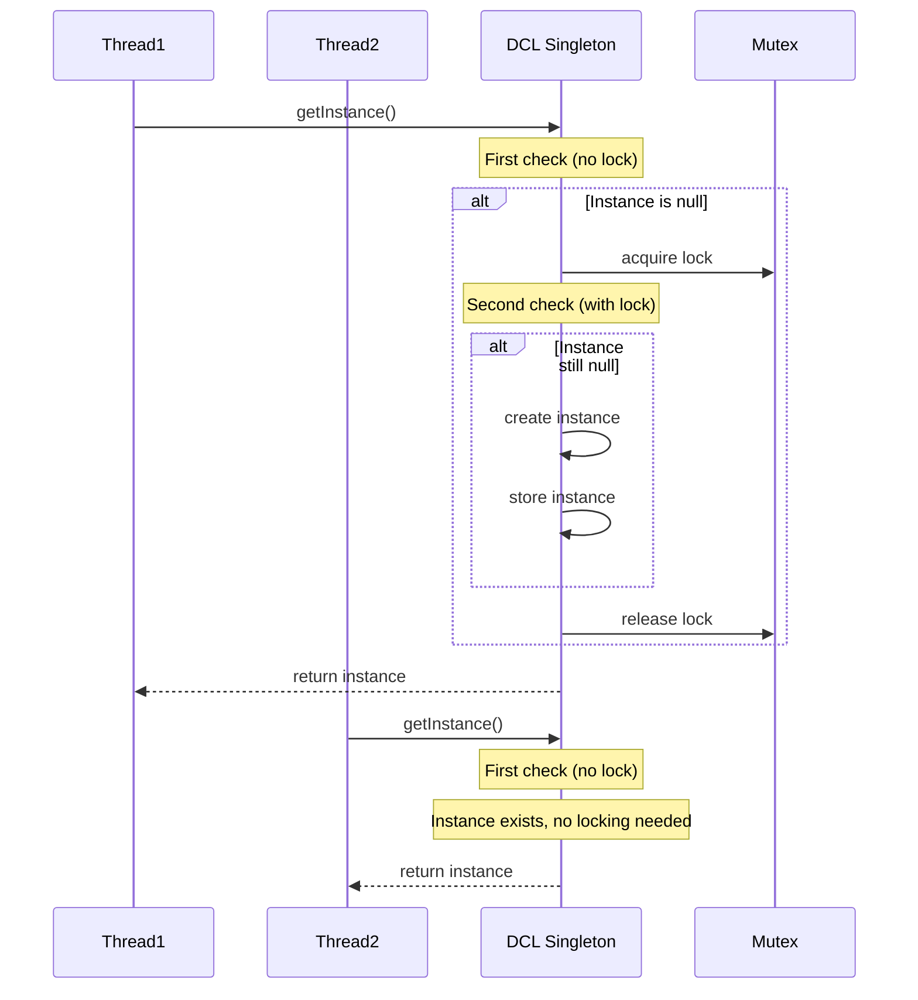
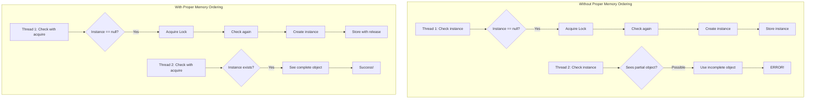
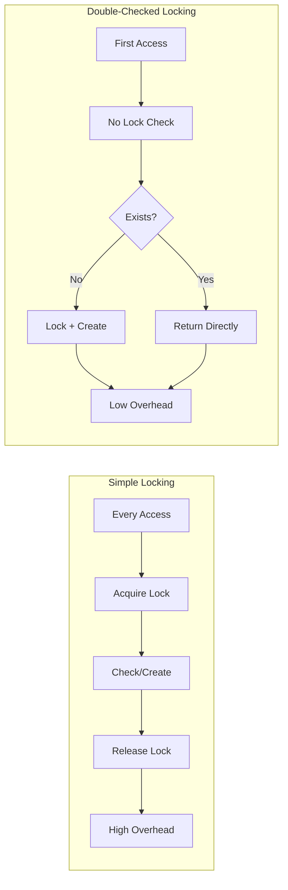

# Double-Checked Locking Pattern

## Intent
Optimize thread-safe lazy initialization by checking a condition twice - once without locking and once with locking - to minimize synchronization overhead while ensuring thread safety.

## When to Use
- Expensive singleton initialization
- Thread-safe lazy loading
- Resource pool initialization
- Performance-critical synchronization
- Avoiding unnecessary locking

## Structure

```mermaid
classDiagram
    class DCLSingleton {
        -instance: atomic~T*~
        -mutex: Mutex
        +getInstance() T*
        -DCLSingleton()
    }
    
    class Client1 {
        +useInstance()
    }
    
    class Client2 {
        +useInstance()
    }
    
    Client1 --> DCLSingleton : calls getInstance()
    Client2 --> DCLSingleton : calls getInstance()
    
    note for DCLSingleton : "1. Check without lock\n2. Lock if needed\n3. Check again with lock\n4. Create if still null"
```

### Double-Checked Locking Flow



### Memory Ordering Considerations



### Performance Comparison



## Implementation Details

### Key Components
1. **Atomic Pointer**: Thread-safe instance storage
2. **Mutex**: Synchronizes creation
3. **Memory Ordering**: Ensures visibility
4. **Double Check**: Reduces lock contention
5. **Lazy Creation**: Defers expensive initialization

### Algorithm
```
Double-Checked Locking:
1. First Check (No Lock):
   - Load instance with acquire semantics
   - If instance exists, return it
   
2. Critical Section:
   - If instance is null, acquire mutex
   - Second check with relaxed semantics
   - If still null:
     a. Create new instance
     b. Store with release semantics
   - Release mutex
   
3. Return instance

Memory Ordering:
- acquire: Ensures no reads/writes move before
- release: Ensures no reads/writes move after
- relaxed: No ordering constraints
```

## Advantages
- Minimal synchronization overhead
- Thread-safe lazy initialization
- Better performance than simple locking
- Maintains singleton guarantees
- Scales well with multiple threads

## Disadvantages
- Complex implementation
- Memory ordering requirements
- Platform-specific behavior
- Potential for subtle bugs
- Requires careful testing

## Example Output
```
=== Double-Checked Locking Pattern Demo ===

=== Classic Double-Checked Locking ===
Thread 0 requesting database connection
Thread 1 requesting database connection
Thread 2 requesting database connection
Thread 3 requesting database connection
Thread 4 requesting database connection
DCL: Creating singleton instance
DatabaseConnection: Creating connection 1 to postgresql://localhost:5432/mydb
Connection 1: Executing 'SELECT * FROM users WHERE id = 0'
Thread 0 got connection ID: 1
Connection 1: Executing 'SELECT * FROM users WHERE id = 1'
Thread 1 got connection ID: 1
Connection 1: Executing 'SELECT * FROM users WHERE id = 2'
Thread 2 got connection ID: 1
Connection 1: Executing 'SELECT * FROM users WHERE id = 3'
Thread 3 got connection ID: 1
Connection 1: Executing 'SELECT * FROM users WHERE id = 4'
Thread 4 got connection ID: 1

=== Modern C++ Double-Checked Locking ===
Thread 0 requesting configuration
Thread 1 requesting configuration
Thread 2 requesting configuration
Thread 3 requesting configuration
DCL: Creating ConfigurationManager instance
ConfigurationManager: Loading config from app_config.json
Thread 0 - App name: MyApplication
Thread 0 - DB host: localhost
Thread 1 - App name: MyApplication
Thread 1 - DB host: localhost
Thread 2 - App name: MyApplication
Thread 2 - DB host: localhost
Thread 3 - App name: MyApplication
Thread 3 - DB host: localhost

=== Generic DCL Template ===
DCL Template: Creating instance of N11GenericDCL6LoggerE
Logger: Initializing with file application.log
[LOG] Message from thread 0 (to application.log)
DCL Template: Creating instance of N11GenericDCL16MetricsCollectorE
MetricsCollector: Initializing metrics system
[LOG] Message from thread 1 (to application.log)
[LOG] Message from thread 2 (to application.log)

Metrics after all threads:
Metrics:
  requests: 3
  thread_0: 1
  thread_1: 1
  thread_2: 1

=== Resource Pool DCL ===
Thread 0 requesting connection
Thread 1 requesting connection
Thread 2 requesting connection
Thread 3 requesting connection
Thread 4 requesting connection
Thread 5 requesting connection
Thread 6 requesting connection
ConnectionPool: Initializing pool with 5 connections
ConnectionPool: Initialization complete
ConnectionPool: Borrowed connection: Connection-5
ConnectionPool: Borrowed connection: Connection-4
ConnectionPool: Borrowed connection: Connection-3
ConnectionPool: Borrowed connection: Connection-2
ConnectionPool: Borrowed connection: Connection-1
ConnectionPool: No connections available
ConnectionPool: No connections available

Returning all borrowed connections:
ConnectionPool: Returned connection: Connection-5
ConnectionPool: Returned connection: Connection-4
ConnectionPool: Returned connection: Connection-3
ConnectionPool: Returned connection: Connection-2
ConnectionPool: Returned connection: Connection-1
Available connections: 5

=== Call-Once DCL ===
Thread 0 requesting service registry
Thread 1 requesting service registry
Thread 2 requesting service registry
Thread 3 requesting service registry
CallOnce DCL: Creating ServiceRegistry instance
ServiceRegistry: Initializing service registry
ServiceRegistry: Registered 4 services
Thread 0 - Database service: postgresql://localhost:5432
Thread 1 - Database service: postgresql://localhost:5432
ServiceRegistry: Registered monitoring -> prometheus://localhost:9090
Thread 2 - Database service: postgresql://localhost:5432
Thread 3 - Database service: postgresql://localhost:5432

All registered services:
  cache -> redis://localhost:6379
  database -> postgresql://localhost:5432
  monitoring -> prometheus://localhost:9090
  queue -> rabbitmq://localhost:5672
  search -> elasticsearch://localhost:9200

=== Double-Checked Locking Benefits ===
1. Reduces synchronization overhead
2. Thread-safe lazy initialization
3. Avoids unnecessary locking
4. Maintains singleton guarantees
5. Better performance than simple locking
```

## Common Variations
1. **Classic DCL**: Raw pointers with atomic operations
2. **Modern DCL**: shared_ptr with atomic operations
3. **Generic DCL**: Template-based implementation
4. **Call-Once DCL**: Using std::call_once
5. **Resource Pool DCL**: For expensive resource initialization

## Related Patterns
- **Singleton**: Primary use case
- **Lazy Loading**: Deferred initialization
- **Thread-Safe Initialization**: Safe concurrent access
- **Resource Pool**: Expensive resource management
- **Memory Barrier**: Low-level synchronization

## Best Practices
1. Use proper memory ordering (acquire/release)
2. Test thoroughly on target platforms
3. Consider std::call_once for simpler cases
4. Document memory ordering requirements
5. Prefer modern C++ alternatives when possible