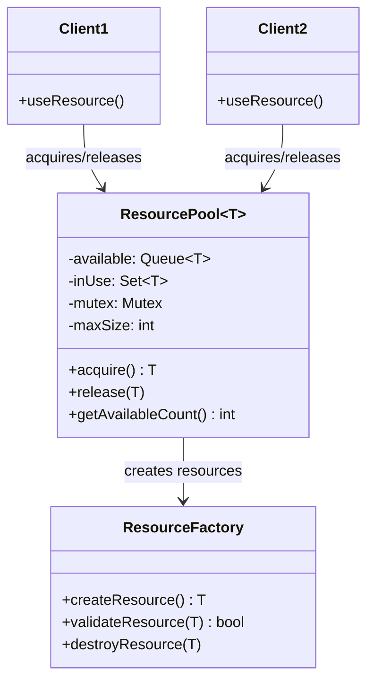
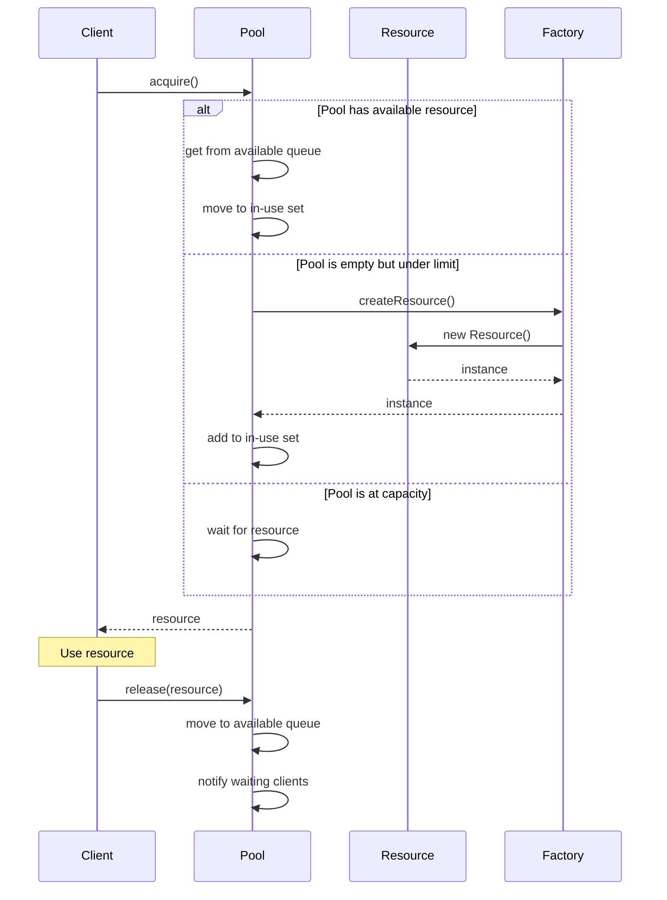
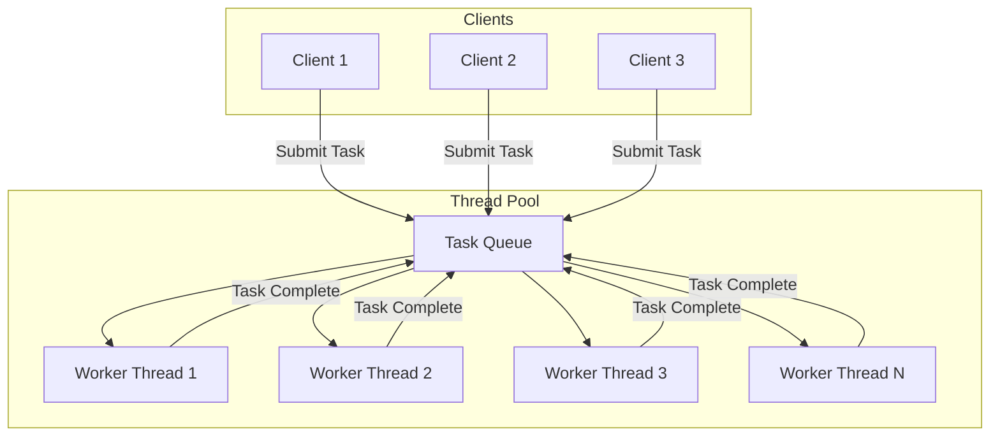

# Resource Pool Pattern

## Intent
Manage a pool of reusable resources to avoid the overhead of creating and destroying expensive resources repeatedly, while controlling resource usage and ensuring thread-safe access.

## When to Use
- Expensive resource creation/destruction
- Limited resource availability
- High-frequency resource usage
- Database connections
- Thread pools
- Memory pools

## Structure



### Resource Lifecycle



### Thread Pool Architecture



### Memory Pool Layout

```mermaid
graph LR
    subgraph "Memory Pool"
        subgraph "Free Blocks"
            F1[Block 1024B]
            F2[Block 1024B]
            F3[Block 1024B]
        end
        
        subgraph "Allocated Blocks"
            A1[Block 1024B - In Use]
            A2[Block 1024B - In Use]
        end
        
        subgraph "Pool Metadata"
            PM[Block Size: 1024B\nMax Blocks: 10\nUsed: 2\nAvailable: 3]
        end
    end
    
    Client1 -->|allocate()| F1
    Client2 -->|deallocate()| A1
    A1 -.->|returns to| F1
```

## Implementation Details

### Key Components
1. **Resource Container**: Stores available resources
2. **Usage Tracking**: Tracks in-use resources
3. **Factory Function**: Creates new resources
4. **Synchronization**: Thread-safe access
5. **Health Checking**: Validates resource state

### Algorithm
```
Resource Acquisition:
1. Lock pool mutex
2. Check available resources
3. If available:
   a. Remove from available queue
   b. Add to in-use set
   c. Return resource
4. If not available but under limit:
   a. Create new resource
   b. Add to in-use set
   c. Return resource
5. If at capacity:
   a. Wait on condition variable
   b. Repeat from step 2

Resource Release:
1. Lock pool mutex
2. Validate resource belongs to pool
3. Remove from in-use set
4. Check resource health (optional)
5. If healthy:
   a. Add to available queue
   b. Notify waiting threads
6. If unhealthy:
   a. Destroy resource
   b. Decrement pool size
```

## Advantages
- Reduced resource creation overhead
- Controlled resource usage
- Better performance and scalability
- Thread-safe resource sharing
- Resource lifecycle management

## Disadvantages
- Memory overhead for pool management
- Complexity in implementation
- Resource health management
- Potential resource leaks
- Pool sizing challenges

## Example Output
```
=== Resource Pool Pattern Demo ===

=== Basic Resource Pool ===
ResourcePool: Created with max size 3
Thread 0 acquiring connection...
Thread 1 acquiring connection...
Thread 2 acquiring connection...
Thread 3 acquiring connection...
Thread 4 acquiring connection...
ResourcePool: Created new resource
Connection conn-1: Connecting to database...
Connection conn-1: Connected
ResourcePool: Acquired resource (1 in use, 0 available)
Connection conn-1: Executing 'SELECT * FROM users WHERE thread_id = 0'
ResourcePool: Created new resource
Connection conn-2: Connecting to database...
Connection conn-2: Connected
ResourcePool: Acquired resource (2 in use, 0 available)
Connection conn-2: Executing 'SELECT * FROM users WHERE thread_id = 1'
ResourcePool: Created new resource
Connection conn-3: Connecting to database...
Connection conn-3: Connected
ResourcePool: Acquired resource (3 in use, 0 available)
Connection conn-3: Executing 'SELECT * FROM users WHERE thread_id = 2'
Thread 0 releasing connection...
ResourcePool: Released resource (2 in use, 1 available)
ResourcePool: Reusing existing resource
ResourcePool: Acquired resource (3 in use, 0 available)
Connection conn-1: Executing 'SELECT * FROM users WHERE thread_id = 3'
Thread 1 releasing connection...
ResourcePool: Released resource (2 in use, 1 available)
ResourcePool: Reusing existing resource
ResourcePool: Acquired resource (3 in use, 0 available)
Connection conn-2: Executing 'SELECT * FROM users WHERE thread_id = 4'
Final pool state: 3 available, 3 total

=== Thread Pool ===
ThreadPool: Creating pool with 3 threads
Worker thread 0 started
Worker thread 1 started
Worker thread 2 started
ThreadPool: Task enqueued (1 in queue)
ThreadPool: Task enqueued (2 in queue)
ThreadPool: Task enqueued (3 in queue)
Worker thread 0 executing task
Task 0 executing
Worker thread 1 executing task
Task 1 executing
Worker thread 2 executing task
Task 2 executing
ThreadPool: Task enqueued (4 in queue)
ThreadPool: Task enqueued (5 in queue)
Task 0 completed
Worker thread 0 executing task
Task 3 executing
Task 1 completed
Worker thread 1 executing task
Task 4 executing
Task 2 completed
Worker thread 2 executing task
Task 5 executing
Task 3 completed
Worker thread 0 executing task
Task 6 executing
Task 4 completed
Worker thread 1 executing task
Task 7 executing
Task 5 completed
Task 6 completed
Task 7 completed

=== Memory Pool ===
MemoryPool: Created with block size 1024 and max 5 blocks
Allocating block 0...
MemoryPool: Allocated block of 1024 bytes
MemoryPool: Created new block (1/5)
Allocated block 0
Allocating block 1...
MemoryPool: Allocated block of 1024 bytes
MemoryPool: Created new block (2/5)
Allocated block 1
...
Pool status: 5 used, 0 available
Allocating block 5...
MemoryPool: No blocks available
Failed to allocate block 5

After partial deallocation: 3 used, 2 available
Successfully allocated from freed blocks

=== Smart Resource Pool (RAII) ===
SmartResourcePool: Created with max size 2

Acquiring resources in scope...
SmartResourcePool: Created new resource (1/2)
Connection smart-conn-1: Connecting to database...
Connection smart-conn-1: Connected
Connection smart-conn-1: Executing 'SELECT 1'
SmartResourcePool: Created new resource (2/2)
Connection smart-conn-2: Connecting to database...
Connection smart-conn-2: Connected
Connection smart-conn-2: Executing 'SELECT 2'
Inner scope ending - conn2 auto-released
SmartResourcePool: Resource returned (1 available)
Connection smart-conn-1: Executing 'SELECT 3'
Outer scope ending - conn1 auto-released
SmartResourcePool: Resource returned (2 available)

All resources should be back in pool
Available resources: 2

=== Resource Pool Benefits ===
1. Efficient resource reuse
2. Controlled resource creation
3. Better performance and scalability
4. Resource lifecycle management
5. Thread-safe resource sharing
```

## Common Variations
1. **Basic Resource Pool**: Simple acquire/release
2. **Thread Pool**: Worker threads for task execution
3. **Memory Pool**: Fixed-size memory blocks
4. **Smart Resource Pool**: RAII with automatic cleanup
5. **Health-Checked Pool**: Resource validation

## Related Patterns
- **Object Pool**: Specific to object instances
- **Singleton**: Single shared resource
- **Factory**: Resource creation
- **Proxy**: Resource access control
- **RAII**: Automatic resource management

## Best Practices
1. Size pools appropriately for workload
2. Implement health checking for long-lived resources
3. Use RAII for automatic resource cleanup
4. Monitor pool metrics for optimization
5. Handle resource creation failures gracefully