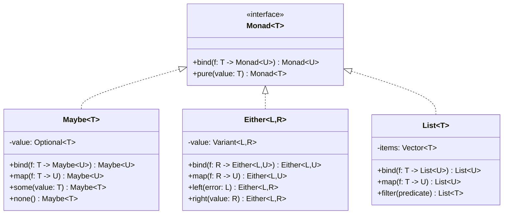
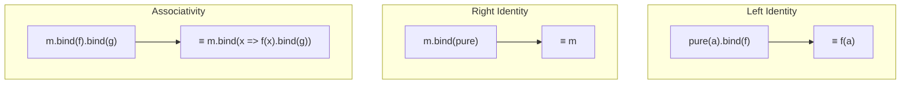
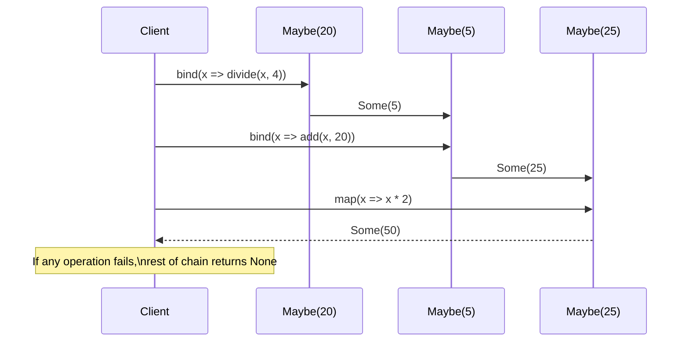
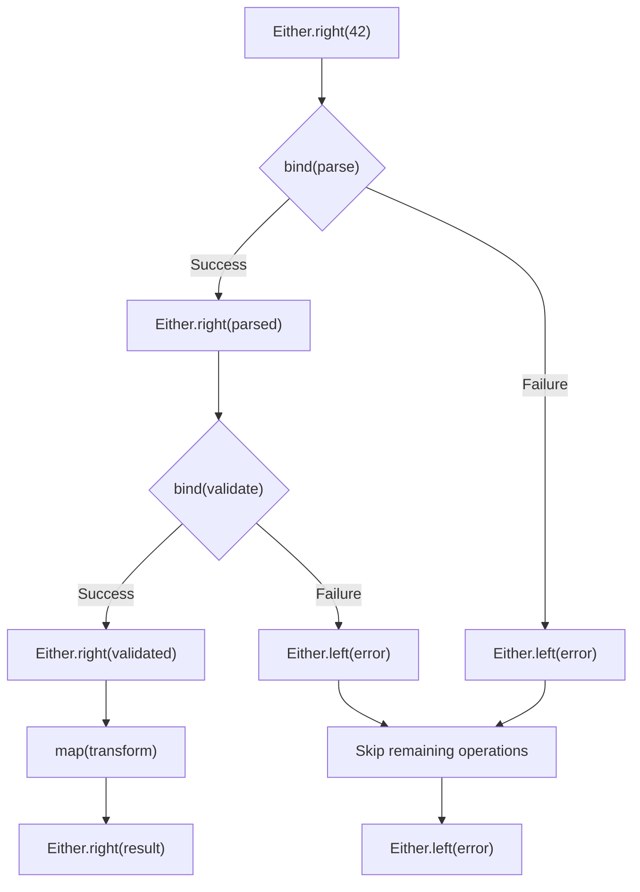

# Monad Pattern

## Intent

Provide a way to wrap values in a computational context and chain operations on those values while automatically handling the context (such as null values, errors, or state), enabling composable and safe functional programming.

## When to Use

- Error handling without exceptions
- Null safety
- State management
- Asynchronous operations
- Functional programming patterns
- Composable computations

## Structure



### Monad Laws



### Maybe Monad Flow



### Either Monad Error Handling



### State Monad Computation

```mermaid
graph LR
    subgraph "State Monad Chain"
        S1["State(0)"] --> |increment| S2["State(1)"]
        S2 --> |add(5)| S3["State(6)"]
        S3 --> |multiply(2)| S4["State(12)"]
        S4 --> |"Result: 12"| R["Final State"]
    end

    subgraph "Threading State"
        T1["Initial State"] --> T2["Operation 1"]
        T2 --> T3["Modified State"]
        T3 --> T4["Operation 2"]
        T4 --> T5["Final State"]
    end
```

## Implementation Details

### Key Components
1. **Monad Interface**: Define bind and pure operations
2. **Context Wrapper**: Encapsulate values with context
3. **Chain Operations**: Enable fluent composition
4. **Error Propagation**: Handle failures gracefully
5. **Type Safety**: Maintain type correctness

### Monad Laws
```
Left Identity:
pure(a).bind(f) ≡ f(a)

Right Identity:
m.bind(pure) ≡ m

Associativity:
(m.bind(f)).bind(g) ≡ m.bind(x => f(x).bind(g))

Functor Law (for map):
m.map(f).map(g) ≡ m.map(x => g(f(x)))
```

### Common Monad Operations
```
Monad Operations:
- bind (flatMap): Chain computations
- map (fmap): Transform values
- pure (return): Wrap value in monad
- join: Flatten nested monads

Utility Operations:
- filter: Conditional selection
- fold: Reduce to single value
- sequence: Transform list of monads
```

## Advantages

- Composable error handling
- Type-safe null handling
- Functional programming style
- Clean separation of concerns
- Readable chaining syntax

## Disadvantages

- Learning curve for developers
- Performance overhead
- Complex type signatures
- Template metaprogramming complexity
- Not idiomatic C++

## Example Output
```
=== Monad Pattern Demo ===

=== Maybe Monad ===
Dividing 20 by 4 = 5
Dividing 5 by 2 = 2
Result 1: Some(4)

Division by zero - returning None
Result 2: None

Square root of 16 = 4
Result 3: Some(8)

=== Either Monad ===
Parsed '42' as 42
Division: 42 / 2 = 21
Result 1: Right(31.5)

Failed to parse 'not_a_number': invalid stoi argument
Result 2: Left(Failed to parse 'not_a_number': invalid stoi argument)

Parsed '100' as 100
Division by zero: 100 / 0
Result 3: Left(Division by zero: 100.000000 / 0.000000)

=== List Monad ===
Finding divisors of 2: [1, 2]
Finding divisors of 1: [1]
Finding divisors of 2: [1, 2]
Finding divisors of 3: [1, 3]
Finding divisors of 1: [1]
Finding divisors of 3: [1, 3]
Finding divisors of 4: [1, 2, 4]
Finding divisors of 1: [1]
Finding divisors of 2: [1, 2]
Finding divisors of 4: [1, 2, 4]
Result 1 (squared divisors): [1, 4, 1, 1, 4, 1, 9, 1, 9, 1, 4, 16, 1, 1, 4, 1, 4, 16]

Words in 'hello world': ["hello", "world"]
Words in 'functional programming': ["functional", "programming"]
Result 2 (words with exclamation): ["hello!", "world!", "functional!", "programming!"]

Original: [1, 2, 3, 4, 5, 6, 7, 8, 9, 10]
Evens: [2, 4, 6, 8, 10]
Sum of evens: 30

=== State Monad ===
Initial state: Counter: 0

Incrementing: 0 -> 1
Adding 5: 1 -> 6
Multiplying by 3: 6 -> 18
Incrementing: 18 -> 19

Final value: 19
Final state: Counter: 19

=== IO Monad ===
Running IO program:
Welcome to the IO Monad demo!
This demonstrates pure functional IO.
The answer is: 42

IO computation completed.

=== Monad Benefits ===
1. Composable computations
2. Error handling without exceptions
3. Functional programming patterns
4. Safe chaining of operations
5. Abstraction over computational contexts
```

## Common Variations
1. **Maybe Monad**: Null safety (Optional)
2. **Either Monad**: Error handling (Result)
3. **List Monad**: Non-deterministic computations
4. **State Monad**: Stateful computations
5. **IO Monad**: Side-effect management

## Related Patterns
- **Functor**: Value transformation in context
- **Applicative**: Function application in context
- **Chain of Responsibility**: Sequential processing
- **Null Object**: Default behavior for null values
- **Result Pattern**: Error handling alternative

## Best Practices
1. Follow monad laws for correctness
2. Use meaningful error types in Either
3. Keep monad operations pure when possible
4. Provide both bind and map operations
5. Consider performance implications of chaining