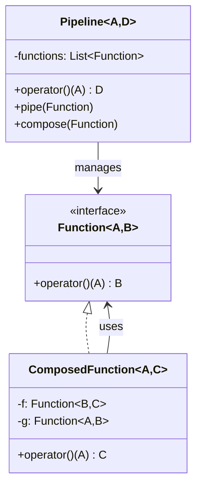
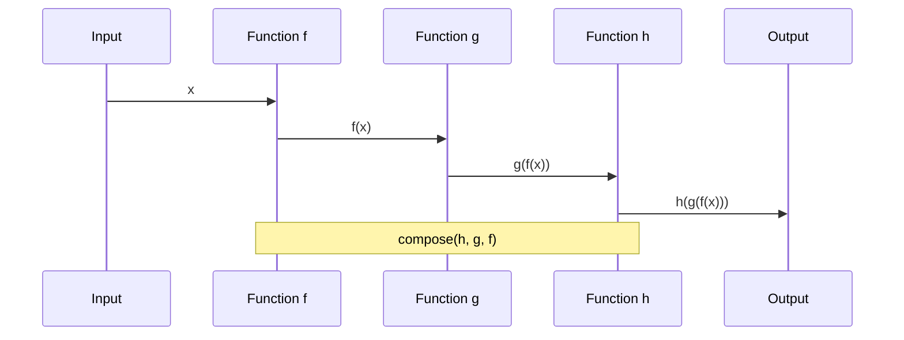
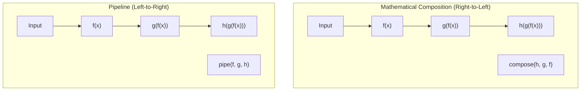
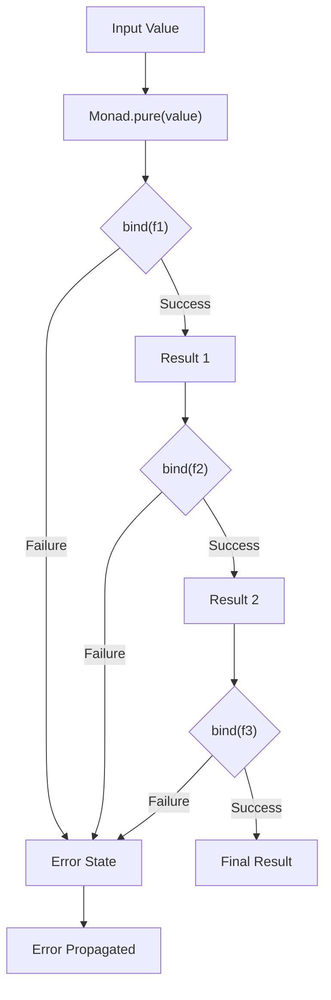
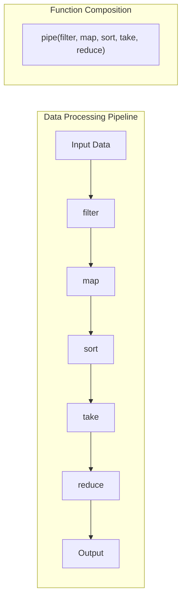

# Function Composition Pattern

## Intent
Combine simple functions to build more complex operations by creating new functions from the composition of existing ones, enabling modular, reusable, and declarative programming.

## When to Use
- Building complex operations from simple parts
- Functional programming paradigms
- Data transformation pipelines
- Modular and reusable code design
- Declarative programming style

## Structure



### Function Composition Flow



### Pipeline vs Composition



### Monadic Composition



### Container Processing Pipeline



## Implementation Details

### Key Components
1. **Compose Function**: Right-to-left composition
2. **Pipe Function**: Left-to-right composition
3. **Variadic Composition**: Multiple function composition
4. **Monadic Composition**: Error-handling composition
5. **Container Operations**: Higher-order functions

### Composition Types
```
Basic Composition:
compose(f, g)(x) = f(g(x))
pipe(f, g)(x) = g(f(x))

Variadic Composition:
compose(f, g, h)(x) = f(g(h(x)))
pipe(f, g, h)(x) = h(g(f(x)))

Monadic Composition:
m.bind(f).bind(g).bind(h)
- Handles failure/null propagation
- Short-circuits on error

Functor Composition:
functor.map(f).map(g).map(h)
- Transforms values in context
- Preserves container structure
```

### Higher-Order Functions
```
Container Operations:
- map: Transform each element
- filter: Select elements by predicate
- reduce/fold: Combine elements
- sort: Order elements
- take: Select first n elements

Composition Operators:
- >>= (bind): Monadic composition
- >> (then): Sequence operations
- <$> (map): Functor mapping
- . (compose): Function composition
```

## Advantages
- Modular and reusable code
- Declarative programming style
- Easy to test individual functions
- Improved code readability
- Functional programming paradigms

## Disadvantages
- Learning curve for developers
- Performance overhead from function calls
- Complex debugging with deep compositions
- Type inference complexity
- Stack overflow with deep recursion

## Example Output
```
=== Function Composition Pattern Demo ===

=== Basic Function Composition ===

Right-to-left composition:
Adding 3 to 5 = 8
Squaring 8 = 64
Converting 64 to string: "64"
Adding prefix "Result: " to "64" = "Result: 64"
Final result: "Result: 64"

Left-to-right composition (pipeline):
Adding 2 to 4 = 6
Multiplying 6 by 3 = 18
Squaring 18 = 324
Converting 324 to string: "324"
Final result: "324"

=== Variadic Function Composition ===

String processing pipeline:
Input: "  hello world from composition  "
Trimmed string: "hello world from composition"
Converting to uppercase: "HELLO WORLD FROM COMPOSITION"
Replaced "HELLO" with "GREETINGS": "GREETINGS WORLD FROM COMPOSITION"
Added brackets: "[GREETINGS WORLD FROM COMPOSITION]"
Final result: "[GREETINGS WORLD FROM COMPOSITION]"

Mathematical composition:
Double: 6
Add 10: 16
Cube: 4096
Final: 4096

=== Container Function Composition ===

Processing pipeline:
Input: [1, 2, 3, 4, 5, 6, 7, 8, 9, 10]
Filtering container
Filtered from 10 to 5 elements
Mapping function over container with 5 elements
Sorting container
Taking first 3 elements
Output: [100, 64, 36]

Reduction pipeline:
Filtering container
Filtered from 10 to 4 elements
Filtered: [6, 7, 8, 9, 10]
Reducing container to single value
Sum of filtered numbers: 40

=== Monadic Function Composition ===

Safe computation chain (success case):
Safe division: 100 / 4 = 25
Safe sqrt: sqrt(25) = 5
Safe log: log(5) = 1.60944
Result 1: Some(1.60944)

Safe computation chain (failure case):
Division by zero avoided
Result 2: None

Safe computation chain (negative sqrt):
Negative square root avoided
Result 3: None

=== Async Function Composition ===

Async computation pipeline:
Async add: 5 + 10 = 15
Async multiply: 15 * 3 = 45
Async add: 45 + 7 = 52
Async toString: 52 -> "Result: 52"
Final async result: "Result: 52"

Another async chain:
Step 1: doubling 2
Step 2: adding 5 to 4
Step 3: squaring 9
Final result: 81

=== Function Composition Benefits ===
1. Modular and reusable code
2. Declarative programming style
3. Easy to test individual functions
4. Improved code readability
5. Functional programming paradigms
```

## Common Variations
1. **Basic Composition**: Simple function chaining
2. **Variadic Composition**: Multiple function composition
3. **Pipeline Composition**: Left-to-right flow
4. **Monadic Composition**: Error-handling composition
5. **Async Composition**: Asynchronous operation chaining

## Related Patterns
- **Chain of Responsibility**: Sequential processing
- **Decorator**: Function wrapping and enhancement
- **Strategy**: Interchangeable function algorithms
- **Command**: Functions as first-class objects
- **Pipeline**: Data processing sequences

## Best Practices
1. Keep individual functions pure and simple
2. Use meaningful function names
3. Prefer immutable data transformations
4. Handle errors gracefully in compositions
5. Consider performance implications of deep compositions