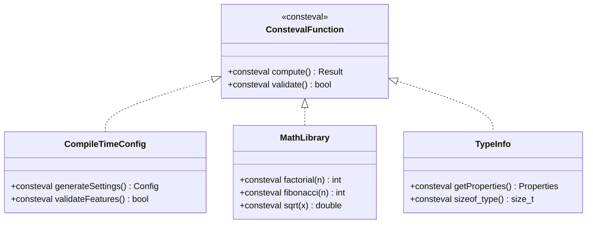
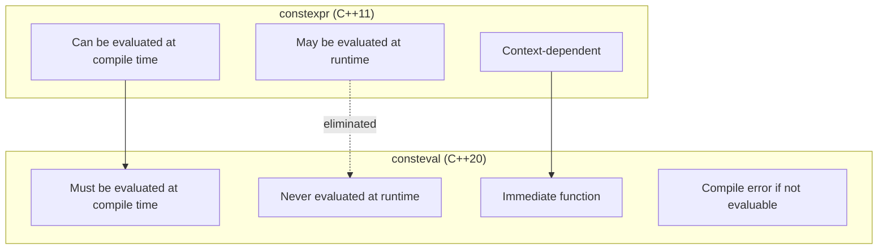
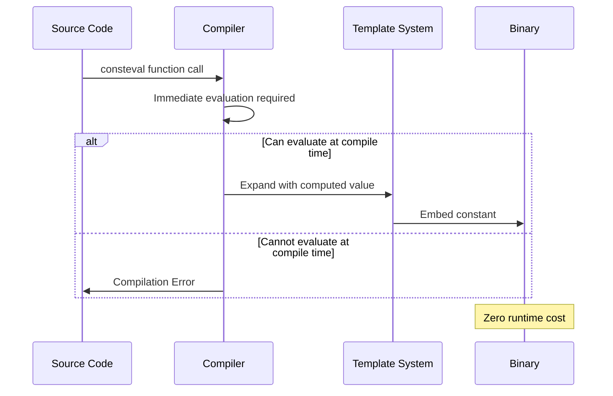
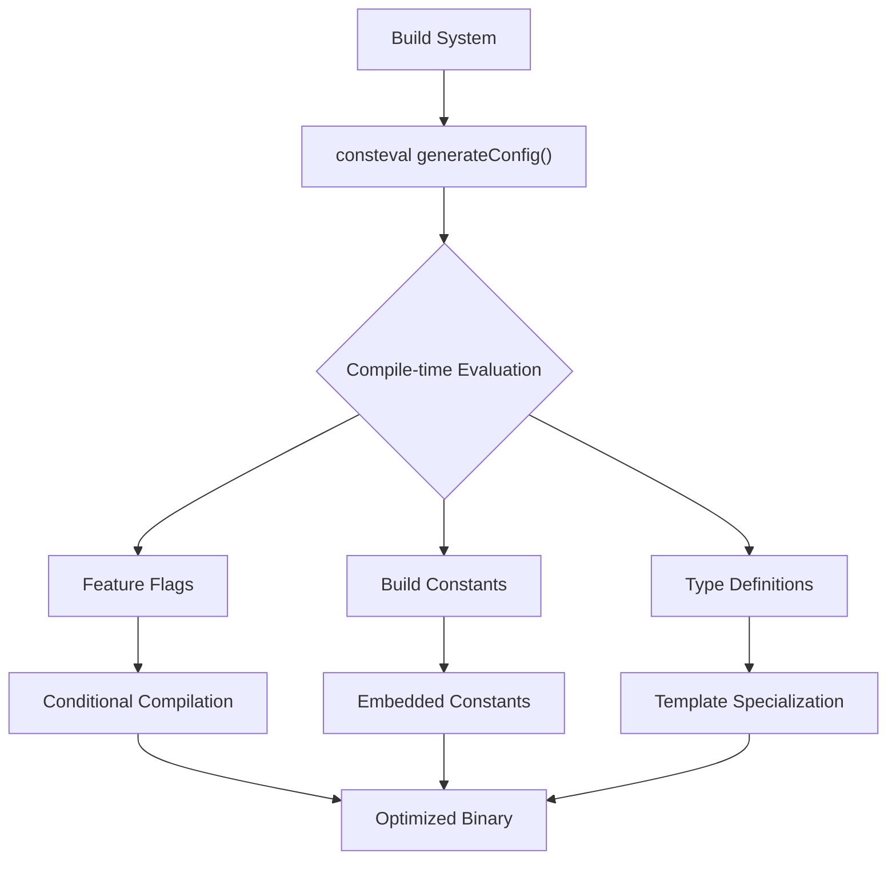

# Consteval Pattern (C++20)

## Intent
Enforce compile-time evaluation of functions and computations, ensuring zero runtime cost while providing compile-time error detection and optimization opportunities through immediate functions.

## When to Use
- Configuration and build-time constants
- Compile-time mathematical computations
- Template metaprogramming improvements
- Zero-cost abstractions
- Compile-time validation and error checking

## Structure



### Consteval vs Constexpr Comparison



### Compile-Time Computation Flow



### Configuration Generation Pattern



## Implementation Details

### Key Components
1. **Immediate Functions**: consteval keyword enforcement
2. **Compile-Time Validation**: Error detection at build time
3. **Zero-Cost Abstractions**: No runtime overhead
4. **Template Integration**: Enhanced metaprogramming
5. **Build-Time Configuration**: Conditional compilation

### Consteval Rules
```
Consteval Requirements:
1. Function must be evaluable at compile time
2. All arguments must be compile-time constants
3. Function body must be constexpr-compatible
4. Cannot be called at runtime
5. Results in compilation error if not evaluable

Benefits:
- Guaranteed compile-time evaluation
- Zero runtime cost
- Enhanced optimization opportunities
- Compile-time error detection
- Improved template metaprogramming
```

### Common Use Cases
```
Compile-Time Mathematics:
- factorial, fibonacci, power functions
- Mathematical constants computation
- Lookup table generation
- Complex number operations

Configuration Management:
- Feature flag evaluation
- Build-time settings
- Platform-specific constants
- Version information

String Processing:
- Compile-time string validation
- Hash computation
- String transformation
- Format string checking

Type Manipulation:
- Type property computation
- Reflection information
- Template parameter validation
- Concept checking
```

## Advantages
- Zero runtime cost - all computed at compile time
- Compile-time error detection
- Optimized binary size and performance
- Type-safe compile-time computations
- Enhanced metaprogramming capabilities

## Disadvantages
- C++20 requirement
- Compilation time increase
- Limited to compile-time evaluable operations
- Debugging complexity
- Template instantiation overhead

## Example Output
```
=== Consteval Pattern Demo (C++20) ===

=== Consteval Compile-Time Configuration ===
Application initializing...
  Logging system enabled
  Profiling system disabled
  Networking system enabled

Build Information:
  Version: 1.0.0
  Build Date: Jan 31 2025
  Build Time: 15:45:23
  Debug Mode: No
  Optimization Level: O2

=== Consteval Math Library ===
Compile-time calculations:
  10! = 3628800
  fib(15) = 610
  √16 = 4
  2^8 = 256

Sine lookup table (8 entries):
  sin(0π/4) ≈ 0
  sin(1π/4) ≈ 0.707107
  sin(2π/4) ≈ 1
  sin(3π/4) ≈ 0.707107
  sin(4π/4) ≈ 1.22465e-16
  sin(5π/4) ≈ -0.707107
  sin(6π/4) ≈ -1
  sin(7π/4) ≈ -0.707107

Math Constants for N = 5:
  e ≈ 2.71828
  5! = 120
  fib(5) = 5
  √5 ≈ 2.23607

=== Consteval String Processing ===
Identifier validation:
  'validName': Valid
  '123invalid': Invalid
  '_underscore_name': Valid

String hashes:
  hash('hello') = 99162322
  hash('world') = 113318802

Identifier: myVariable (hash: 3735334241)
Identifier: _private_member (hash: 2087165545)

Uppercase transformation: HELLO WORLD
String builder result: Hello Consteval World!

=== Consteval Type Information ===

int type info:
Type Information:
  Size: 4 bytes
  Alignment: 4 bytes
  Is pointer: No
  Is reference: No
  Is const: No
  Is integral: Yes
  Is floating point: No
  Is class: No

double* type info:
Type Information:
  Size: 8 bytes
  Alignment: 8 bytes
  Is pointer: Yes
  Is reference: No
  Is const: No
  Is integral: No
  Is floating point: No
  Is class: No

=== Consteval Factory Pattern ===
Compile-time created shapes:
  Circle area: 28.2743
  Rectangle area: 24

Shape collection areas:
  Shape 0 area: 78.5398
  Shape 1 area: 80

=== Consteval Benefits ===
1. Zero runtime cost - all computed at compile time
2. Compile-time error detection
3. Optimized binary size and performance
4. Type-safe compile-time computations
5. Enhanced metaprogramming capabilities
```

## Common Variations
1. **Configuration Generator**: Build-time feature flags
2. **Math Library**: Compile-time mathematical functions
3. **String Processor**: Compile-time string operations
4. **Type Inspector**: Compile-time type information
5. **Factory Pattern**: Compile-time object creation

## Related Patterns
- **Template Metaprogramming**: Compile-time computation
- **SFINAE**: Template specialization
- **Concepts**: Type constraints
- **Constexpr**: Compile-time evaluation
- **Policy-Based Design**: Compile-time configuration

## Best Practices
1. Use consteval for functions that should never run at runtime
2. Combine with constexpr for flexible evaluation contexts
3. Validate inputs at compile time when possible
4. Generate lookup tables and constants at build time
5. Use for configuration and feature flag management
6. Profile compilation times for complex computations
7. Provide meaningful error messages for invalid inputs

## 🔧 Compilation & Usage

### Prerequisites
- **C++ Standard**: C++20 (mandatory - consteval is C++20 only)
- **Compiler**: GCC 10.0+, Clang 10.0+, MSVC 2019 16.7+

### Basic Compilation

#### Linux/macOS
```bash
# Basic C++20 compilation
g++ -std=c++20 -o consteval consteval.cpp

# With Clang
clang++ -std=c++20 -o consteval consteval.cpp

# Explicit C++20 features
g++ -std=c++20 -fconstexpr-ops-limit=33554432 -o consteval consteval.cpp
```

#### Windows (MinGW)
```batch
g++ -std=c++20 -o consteval.exe consteval.cpp
```

#### Windows (MSVC)
```batch
cl /EHsc /std:c++20 consteval.cpp
```

### Advanced Compilation Options

#### Debug Build with Consteval Debugging
```bash
g++ -std=c++20 -g -O0 -DDEBUG -fconstexpr-backtrace-limit=100 -o consteval_debug consteval.cpp
```

#### Optimized Release Build
```bash
g++ -std=c++20 -O3 -DNDEBUG -DCONSTEVAL_OPTIMIZATION -o consteval_release consteval.cpp
```

#### Constexpr Debugging and Limits
```bash
# Increase constexpr evaluation limits
g++ -std=c++20 -fconstexpr-ops-limit=67108864 -fconstexpr-depth=512 -o consteval consteval.cpp

# Enable constexpr debugging
g++ -std=c++20 -fconstexpr-backtrace-limit=100 -fconstexpr-cache-depth=8 -o consteval consteval.cpp
```

#### Warning and Analysis
```bash
g++ -std=c++20 -Wall -Wextra -Wpedantic -Weffc++ -o consteval consteval.cpp
```

### CMake Instructions

Create `CMakeLists.txt`:
```cmake
cmake_minimum_required(VERSION 3.16)  # C++20 support
project(ConstevalPattern)

# Set C++20 standard (required)
set(CMAKE_CXX_STANDARD 20)
set(CMAKE_CXX_STANDARD_REQUIRED ON)
set(CMAKE_CXX_EXTENSIONS OFF)

# Check for C++20 consteval support
include(CheckCXXCompilerFlag)
check_cxx_compiler_flag("-std=c++20" COMPILER_SUPPORTS_CXX20)

if(NOT COMPILER_SUPPORTS_CXX20)
    message(FATAL_ERROR "Compiler does not support C++20")
endif()

# Create executable
add_executable(consteval consteval.cpp)

# Compiler-specific options
if(MSVC)
    target_compile_options(consteval PRIVATE 
        /W4 /std:c++20 /Zc:preprocessor)
    # Increase constexpr evaluation limits for MSVC
    target_compile_options(consteval PRIVATE 
        /constexpr:depth512 /constexpr:backtrace100)
else()
    target_compile_options(consteval PRIVATE 
        -Wall -Wextra -Wpedantic -std=c++20)
    # GCC/Clang specific constexpr options
    target_compile_options(consteval PRIVATE 
        -fconstexpr-ops-limit=67108864 
        -fconstexpr-depth=512 
        -fconstexpr-backtrace-limit=100)
endif()

# Feature test macro check
target_compile_definitions(consteval PRIVATE 
    $<$<BOOL:${CMAKE_CXX_COMPILER_ID STREQUAL "GNU"}}>:_GNU_SOURCE>)
```

Build with CMake:
```bash
mkdir build && cd build
cmake -DCMAKE_BUILD_TYPE=Release ..
make -j$(nproc)

# Debug build with enhanced diagnostics
cmake -DCMAKE_BUILD_TYPE=Debug -DCMAKE_CXX_FLAGS_DEBUG="-g -O0 -fconstexpr-backtrace-limit=100" ..
make -j$(nproc)
```

### IDE Integration

#### Visual Studio Code
Create `.vscode/tasks.json`:
```json
{
    "version": "2.0.0",
    "tasks": [
        {
            "label": "build-cpp20",
            "type": "shell",
            "command": "g++",
            "args": [
                "-std=c++20",
                "-fconstexpr-ops-limit=67108864",
                "-g",
                "-Wall",
                "-Wextra",
                "${file}",
                "-o",
                "${fileDirname}/${fileBasenameNoExtension}"
            ],
            "group": {
                "kind": "build",
                "isDefault": true
            }
        },
        {
            "label": "build-consteval-debug",
            "type": "shell",
            "command": "g++",
            "args": [
                "-std=c++20",
                "-fconstexpr-backtrace-limit=100",
                "-fconstexpr-depth=512",
                "-g",
                "-O0",
                "${file}",
                "-o",
                "${fileDirname}/${fileBasenameNoExtension}_debug"
            ],
            "group": "build"
        }
    ]
}
```

Create `.vscode/c_cpp_properties.json`:
```json
{
    "configurations": [
        {
            "name": "Linux/macOS",
            "cStandard": "c17",
            "cppStandard": "c++20",
            "compilerArgs": [
                "-fconstexpr-ops-limit=67108864"
            ]
        }
    ]
}
```

#### Visual Studio
1. Create new Console Application project
2. Project Properties → C/C++ → Language → C++ Language Standard: C++20 (`/std:c++20`)
3. Project Properties → C/C++ → Command Line → Additional Options: `/constexpr:depth512`
4. Copy the code to main source file
5. Build with Ctrl+F7

#### CLion
1. Open project directory
2. Ensure CMakeLists.txt specifies C++20
3. File → Settings → Build → CMake → CMake options: `-DCMAKE_CXX_STANDARD=20`
4. Build with Ctrl+F9

### Dependencies
- **Standard Library**: 
  - `<iostream>`, `<array>`, `<string_view>`, `<type_traits>`
  - `<algorithm>`, `<cmath>`, `<span>` (C++20)
- **C++20 Features**: consteval, constexpr enhanced, concepts
- **No external dependencies required**

### C++20 Specific Considerations

#### Compiler Version Requirements
```bash
# Check GCC version (10.0+ required)
g++ --version | grep -o 'g++ ([^)]*) [0-9]*\.[0-9]*'

# Check Clang version (10.0+ required) 
clang++ --version | grep -o 'clang version [0-9]*\.[0-9]*'

# Test C++20 consteval support
echo 'consteval int test() { return 42; } int main() { return test(); }' | g++ -std=c++20 -x c++ -
```

#### Compilation Time Considerations
```bash
# Profile compilation time
time g++ -std=c++20 -ftime-report consteval.cpp

# Reduce compilation time for complex consteval
g++ -std=c++20 -fconstexpr-cache-depth=16 consteval.cpp
```

### Platform-Specific Notes

#### Linux
- **Ubuntu 20.04+**: `sudo apt-get install gcc-10 g++-10`
- **Arch Linux**: GCC 10+ available in repos
- Use `update-alternatives` to set default compiler

#### macOS
- **Xcode 12+**: Full C++20 support
- **Homebrew**: `brew install gcc` (GCC 11+)
- Check with: `clang++ -std=c++20 -dM -E - < /dev/null | grep __cplusplus`

#### Windows
- **Visual Studio 2019 16.7+**: C++20 consteval support
- **Visual Studio 2022**: Full C++20 support recommended
- **MinGW-w64**: Use GCC 10+ builds

### Troubleshooting

#### Common Issues
1. **"consteval not recognized"**: Upgrade compiler to C++20 support
2. **Evaluation limit exceeded**: Increase `-fconstexpr-ops-limit`
3. **Complex consteval timeout**: Reduce computation complexity
4. **Template instantiation errors**: Check C++20 concepts usage

#### Consteval-Specific Debugging
```bash
# Detailed constexpr evaluation trace
g++ -std=c++20 -fconstexpr-backtrace-limit=100 -v consteval.cpp

# Check feature test macros
echo '#include <iostream>
int main() { 
    std::cout << __cpp_consteval << std::endl; 
    return 0; 
}' | g++ -std=c++20 -x c++ -
```

#### Performance Tips
- Keep consteval functions simple and focused
- Use `if consteval` for conditional compilation
- Profile compilation times for complex computations
- Consider splitting large consteval computations
- Cache intermediate results when possible

### Feature Test Macros
```cpp
#if __cpp_consteval >= 201811L
    // consteval is available
#else
    #error "C++20 consteval support required"
#endif
```