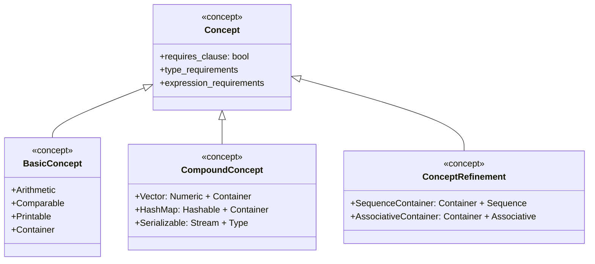
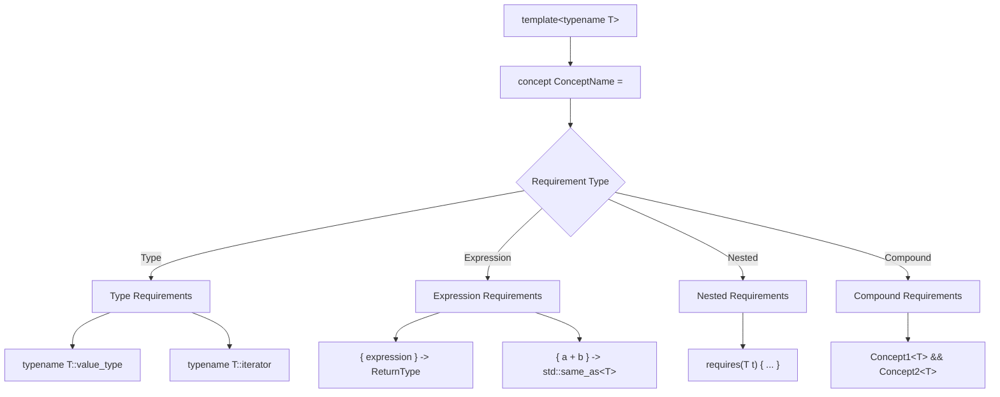
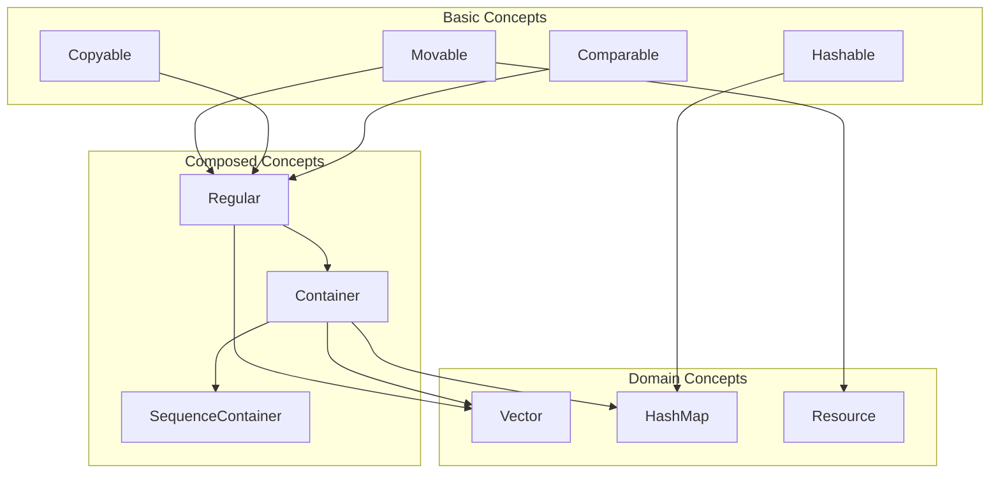

# Concepts Pattern (C++20)

## Intent
Define named sets of requirements for template parameters, providing clear, readable constraints that improve code documentation, error messages, and template interface design.

## When to Use
- Template parameter constraints
- Self-documenting generic code
- Better compiler error messages
- Interface specification for generic programming
- Type-safe template metaprogramming

## Structure



### Concept Definition Syntax



### Template Constraint Flow

```mermaid
sequenceDiagram
    participant Code as Template Code
    participant Compiler
    participant Concept as Concept Check
    participant Instantiation
    
    Code->>Compiler: template&lt;Concept T&gt; func(T t)
    Compiler->>Concept: Check T satisfies Concept
    
    alt Concept satisfied
        Concept->>Compiler: Requirements met
        Compiler->>Instantiation: Proceed with instantiation
        Instantiation-->>Code: Compiled function
    else Concept not satisfied
        Concept->>Compiler: Requirements not met
        Compiler-->>Code: Clear error message
    end
```

### Concept Composition



## Implementation Details

### Key Components
1. **Concept Definition**: Named requirement specification
2. **Type Requirements**: Required nested types
3. **Expression Requirements**: Required operations
4. **Semantic Requirements**: Expected behavior
5. **Concept Composition**: Building complex constraints

### Concept Syntax
```cpp
Basic Concept:
template<typename T>
concept ConceptName = requirement_expression;

Expression Requirements:
requires(T t) {
    { expression } -> return_type_constraint;
    { t.method() } -> std::same_as<ReturnType>;
    { t + t } -> std::convertible_to<T>;
}

Type Requirements:
requires {
    typename T::value_type;
    typename T::iterator;
    typename T::size_type;
}

Compound Requirements:
template<typename T>
concept Compound = Concept1<T> && Concept2<T> && 
                  additional_requirements;

Constraint Usage:
template<ConceptName T>
void function(T parameter);

template<typename T>
    requires ConceptName<T>
void function(T parameter);

template<typename T>
void function(T parameter) requires ConceptName<T>;
```

### Common Standard Concepts
```cpp
Core Language Concepts:
- std::same_as<T, U>
- std::derived_from<T, Base>
- std::convertible_to<T, U>
- std::common_reference_with<T, U>

Comparison Concepts:
- std::equality_comparable<T>
- std::totally_ordered<T>

Object Concepts:
- std::movable<T>
- std::copyable<T>
- std::semiregular<T>
- std::regular<T>

Callable Concepts:
- std::invocable<F, Args...>
- std::predicate<F, Args...>

Iterator Concepts:
- std::input_iterator<I>
- std::forward_iterator<I>
- std::bidirectional_iterator<I>
- std::random_access_iterator<I>
```

## Advantages
- Clear, readable template constraints
- Better error messages
- Self-documenting code
- Compile-time interface checking
- Enhanced template metaprogramming

## Disadvantages
- C++20 requirement
- Learning curve for developers
- Increased compilation time
- Concept design complexity
- Limited tooling support initially

## Example Output
```
=== Concepts Pattern Demo (C++20) ===

=== Basic Concepts ===
Adding arithmetic types: 5 + 3 = 8
Adding arithmetic types: 2.5 + 1.7 = 4.2

Finding max of comparable types: 10
Finding max of comparable types: banana

Printing: 42
Printing: Hello Concepts!
Container contents: [1, 2, 3, 4, 5]

=== Advanced Concepts ===
Dot product calculated
Dot product result: 32

String-Int Map contents:
  apple -> 5
  banana -> 3
  cherry -> 8

=== Concept-Based Design Patterns ===
Original data: 64 34 25 12 22 11 90 
Using strategy: Bubble Sort
Performing bubble sort
Sorted data: 11 12 22 25 34 64 90 

Notifying all observers about: System startup completed
Logger: System startup completed
Email: System startup completed

Creating button
Using product of type: Button
Button clicked
Creating text field
Using product of type: TextField
Text entered

=== Concept-Based Specialization ===
Processing integer: 42 (even: yes)
Processing float: 3.14159 (rounded: 3)
Processing string: "Hello World" (length: 11)

Summing integer range
Sum: 15
Averaging floating-point range
Average: 3.3

=== Concept Composition ===
RAII: Acquired resource
Working with file: test.txt
RAII: Releasing resource
Closing file: test.txt

Demonstrating sequence container operations:
  Initial size: 0
  Added integers, new size: 2
  Front: 42, Back: 84

=== Concepts Benefits ===
1. Clear, readable template constraints
2. Better error messages
3. Self-documenting code
4. Compile-time interface checking
5. Enhanced template metaprogramming
```

## Common Variations
1. **Basic Concepts**: Simple type constraints
2. **Compound Concepts**: Multiple requirement combination
3. **Concept Refinement**: Hierarchical concept relationships
4. **Domain-Specific Concepts**: Application-specific constraints
5. **Concept-Based Design Patterns**: Pattern implementation with concepts

## Related Patterns
- **Template Metaprogramming**: Generic programming foundation
- **SFINAE**: Enable-if pattern predecessor
- **Policy-Based Design**: Compile-time configuration
- **Traits**: Type property specification
- **Constexpr If**: Conditional compilation

## Best Practices
1. **Name concepts clearly** - Use descriptive, domain-appropriate names
2. **Keep concepts focused** - Single responsibility principle
3. **Compose concepts** - Build complex constraints from simple ones
4. **Document semantic requirements** - Specify expected behavior
5. **Use standard concepts** - Leverage existing library concepts
6. **Provide good error messages** - Use requires clauses for clarity
7. **Test concept satisfaction** - Verify requirements are met
8. **Consider concept refinement** - Build hierarchical relationships