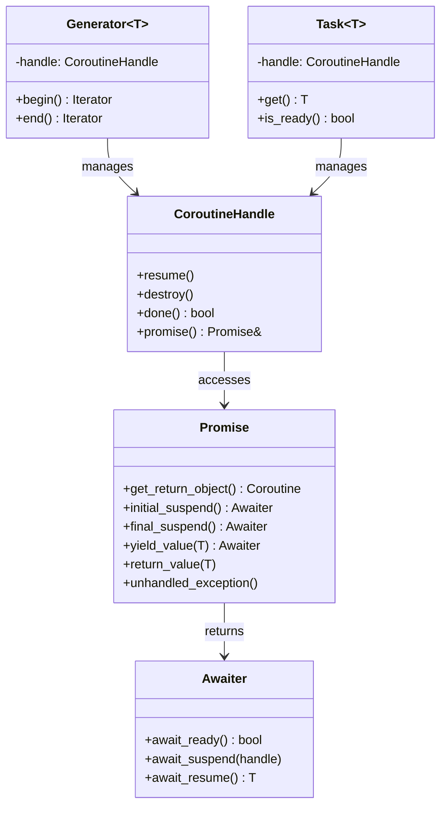
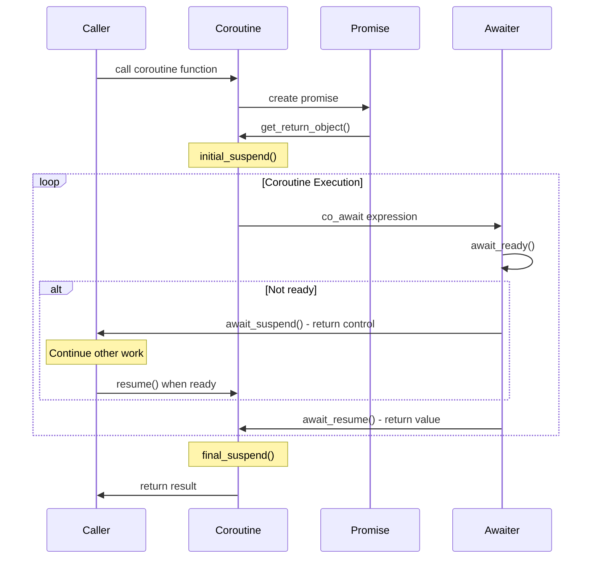
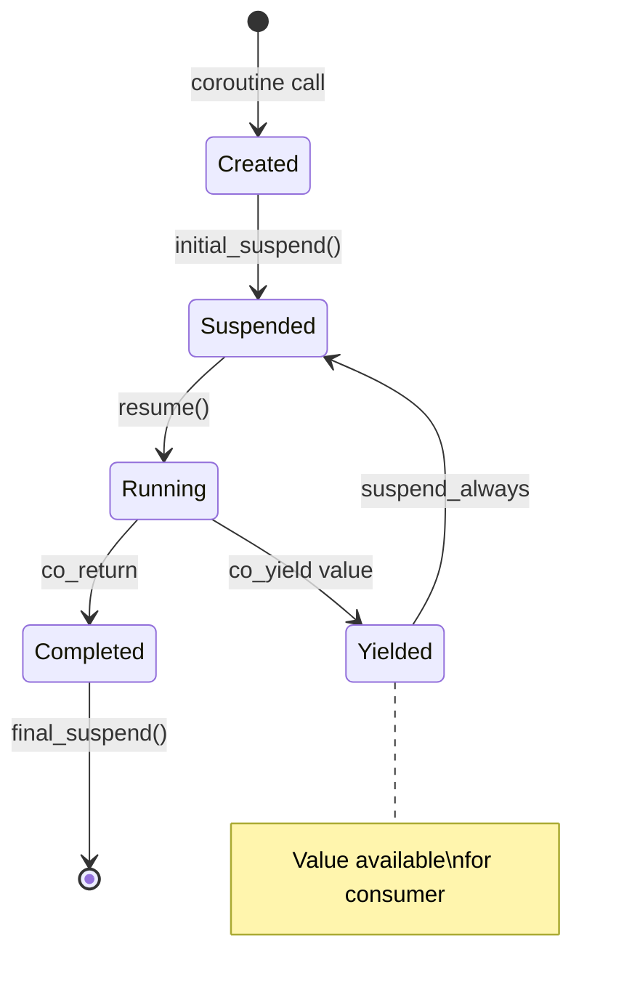
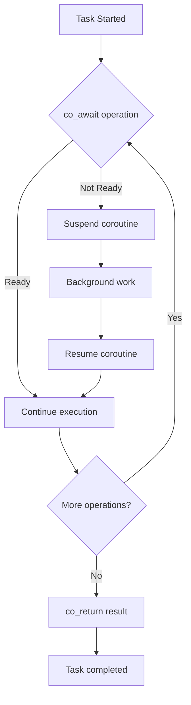

# Coroutines Pattern (C++20)

## Intent
Enable cooperative multitasking and asynchronous programming through functions that can suspend and resume execution, providing a natural way to write sequential-looking code for asynchronous operations.

## When to Use
- Asynchronous I/O operations
- Generator implementations
- State machine modeling
- Producer-consumer patterns
- Cooperative multitasking
- Lazy evaluation sequences

## Structure



### Coroutine Execution Flow



### Generator Pattern



### Async Task Execution



## Implementation Details

### Key Components
1. **Promise Type**: Defines coroutine behavior
2. **Coroutine Handle**: Controls execution
3. **Awaiter**: Manages suspension points
4. **co_await**: Suspension operator
5. **co_yield**: Generator yield operator
6. **co_return**: Return value operator

### Coroutine Keywords
```cpp
co_await:
- Suspends coroutine until awaitable is ready
- Returns result from await_resume()
- Used for asynchronous operations

co_yield:
- Suspends coroutine and yields value
- Used in generator pattern
- Returns control to caller with value

co_return:
- Returns final value from coroutine
- Calls promise.return_value() or return_void()
- Triggers final_suspend()

Promise Requirements:
- get_return_object(): Create coroutine object
- initial_suspend(): Suspend at start?
- final_suspend(): Suspend at end?
- return_value()/return_void(): Handle co_return
- unhandled_exception(): Handle exceptions
- yield_value(): Handle co_yield (optional)

Awaiter Requirements:
- await_ready(): Is result ready?
- await_suspend(): What to do when suspending
- await_resume(): Return result when resumed
```

### Common Patterns
```cpp
Generator Pattern:
- Use co_yield to produce values
- Lazy evaluation of sequences
- Iterator-like interface
- Memory efficient for large sequences

Async Task Pattern:
- Use co_await for async operations
- Chain asynchronous operations
- Exception propagation
- Future-like interface

State Machine Pattern:
- Use co_yield for state transitions
- Natural state representation
- Step-by-step execution
- Pausable/resumable processing
```

## Advantages
- Simplified asynchronous programming
- Natural sequential code structure
- Efficient cooperative multitasking
- Generator pattern implementation
- State machine modeling

## Disadvantages
- C++20 requirement
- Steep learning curve
- Complex implementation details
- Limited standard library support
- Debugging complexity

## Example Output
```
=== Coroutines Pattern Demo (C++20) ===

=== Basic Generator Coroutines ===

Fibonacci sequence (first 8 numbers):
Starting fibonacci generator
Generated fibonacci: 0
Main: got fibonacci value 0
Generated fibonacci: 1
Main: got fibonacci value 1
Generated fibonacci: 1
Main: got fibonacci value 1
Generated fibonacci: 2
Main: got fibonacci value 2
Generated fibonacci: 3
Main: got fibonacci value 3
Generated fibonacci: 5
Main: got fibonacci value 5
Generated fibonacci: 8
Main: got fibonacci value 8
Generated fibonacci: 13
Main: got fibonacci value 13
Fibonacci generator finished

Range generator (0 to 10, step 2):
Starting range generator: 0 to 10 step 2
Generated range value: 0
Main: got range value 0
Generated range value: 2
Main: got range value 2
Generated range value: 4
Main: got range value 4
Generated range value: 6
Main: got range value 6
Generated range value: 8
Main: got range value 8
Range generator finished

Tokenizer generator:
Starting tokenization of: "hello,world,coroutines,are,awesome"
Generated token: "hello"
Main: got token "hello"
Generated token: "world"
Main: got token "world"
Generated token: "coroutines"
Main: got token "coroutines"
Generated token: "are"
Main: got token "are"
Generated final token: "awesome"
Main: got token "awesome"
Tokenization finished

=== Async Task Coroutines ===

Starting async computation...
Starting async computation for: 7
Halfway through computation...
Computation completed
Async computation result: 49

Starting processing chain...
Starting processing chain
Starting async computation for: 5
Halfway through computation...
Computation completed
First computation result: 25
Starting async computation for: 5
Halfway through computation...
Computation completed
Second computation result: 25
Processing chain result: 50

=== State Machine Coroutines ===

Starting file processing for: example.txt

Advancing through state machine:
Current state: Start
State: Start - Initializing
Current state: Processing
State: Processing - Reading file
Current state: Processing
State: Processing - Step 1/3
Current state: Processing
State: Processing - Step 2/3
Current state: Processing
State: Processing - Step 3/3
Current state: Waiting
State: Waiting - External validation
Current state: Waiting
State: Waiting - Validation complete
Current state: Completed
State: Completed - File processed successfully
Final state: Completed

=== Producer-Consumer Coroutines ===

Producer starting: will produce 5 items starting from 100
Consumer A starting: will consume 3 items
Consumer B starting: will consume 2 items

Producer-Consumer demo started
(Note: This is a simplified demo - real implementation would use proper scheduling)
Producer-Consumer demo completed

=== Coroutines Benefits ===
1. Simplified asynchronous programming
2. Natural sequential code structure
3. Efficient cooperative multitasking
4. Generator pattern implementation
5. State machine modeling
```

## Common Variations
1. **Generator**: Lazy sequence generation with co_yield
2. **Async Task**: Asynchronous operations with co_await
3. **State Machine**: Step-by-step state transitions
4. **Producer-Consumer**: Channel-based communication
5. **Recursive Coroutines**: Self-calling coroutines

## Related Patterns
- **Iterator**: Generator provides iteration interface
- **Future/Promise**: Async task similar to futures
- **State Machine**: Explicit state modeling
- **Observer**: Event-driven coroutine coordination
- **Pipeline**: Data processing with coroutines

## Best Practices
1. **Use RAII for resource management** - Coroutines can suspend anywhere
2. **Handle exceptions properly** - Use unhandled_exception() in promise
3. **Avoid capturing by reference** - Coroutine lifetime issues
4. **Design clear awaiter interfaces** - Make suspension points obvious
5. **Consider performance implications** - Heap allocation for coroutine frames
6. **Test suspension points thoroughly** - Complex execution paths
7. **Use standard awaiters when available** - Leverage library implementations
8. **Document coroutine contracts** - Suspension and resumption behavior